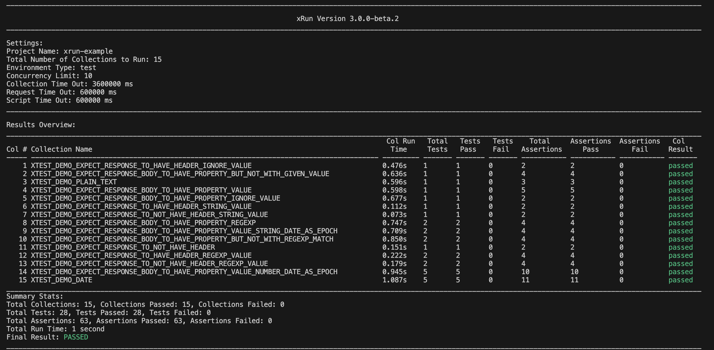
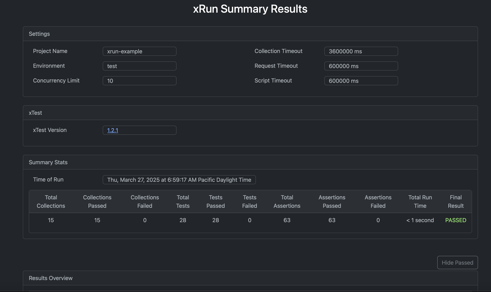

# Example xRun Repo

## Overview
This repo provides an example repostory for running xRun API tests. See the [xRun project](https://github.com/schwabyio/xrun) for more details.

## Steps to run
1. Fork or clone this repo to your local machine:
```shell
git clone git@github.com:schwabyio/xrun-example-repo.git
```
2. Install xRun:
```shell
npm install -g @schwabyio/xrun
```
3. From your terminal, cd into the base directory of this repo:
```shell
cd <YOUR-REPO-PATH>/xrun-example-repo
```
4. From the base directory of this repo, on your local machine, run all tests with xrun:
```shell
xrun all
```

## Output
1. You should see a CLI output, similar to the following:


2. You should see an html report auto open in your browser, similar to the following:
